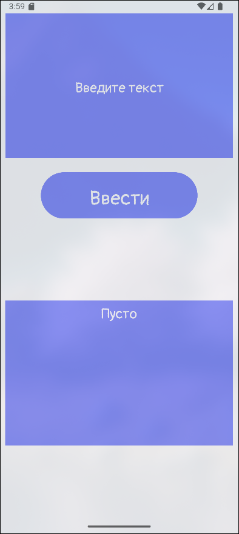
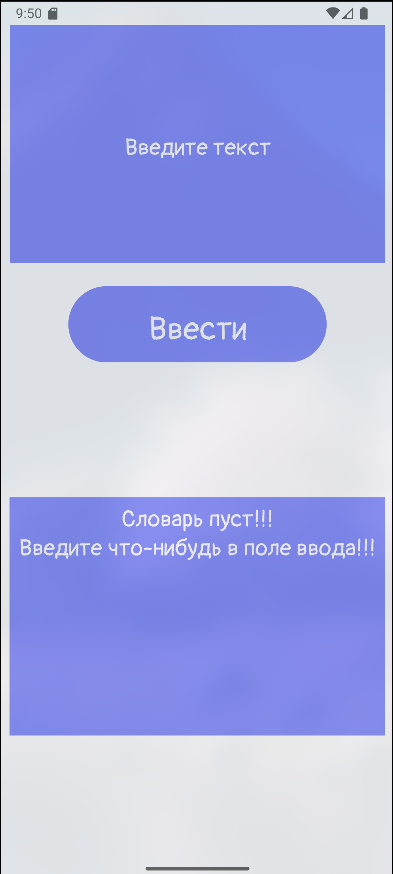

### Word Counter
---
### RU

Данная утилита нужна для подсчёта повторений каждого слова в пользовательском тексте.

### Как это выглядит
 

*Рис. 1. Экран приложения при запуске*

 

*Рис. 2. Пример работы приложения*

*Рис. 3. Проверка на пустоту*

---
### ENG
This utility counts how many times each word appears in user-supplied text.

### How it looks

*Fig. 1. Application screen at launch*

*Fig. 2. Example of the app in action*

  
*Fig. 3. Empty-input validation*